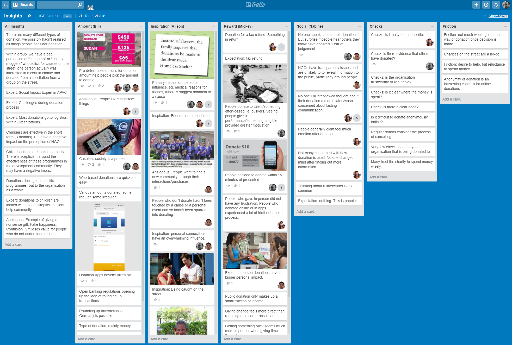

# Insight Statements

> "How might we reduce the friction between the decision to donate and the act of donating?"

* Payment
* Social
* Inspiration
* Reward

---

## Theme: Payment

1. Pre-determined options for recommended donation amounts help people pick the
   amount to donate.
2. Donating available change at the end of a supermarket checkout is
   a frictionless way to donate.
3. People don't like to talk about how much they have donated.
4. People find it difficult to gauge monetary amounts, preferring "all you can
   eat" deals.
5. Parting with available change is decreasing in popularity as society moves
   towards away from cash for every day transactions.
6. Recurring donations are effective in the short term, but often lead to
   cancellation.
7. The thought of cancelling a recurring donation has put people off donating
   in the first place.

### Insight

1. People find it difficult to gauge how much to donate.
2. People find it easy to discard change, but this is a challenge in a cashless
   society.
3. Recurring transactions are particularly hard to assess and the idea of
   cancelation introduces friction into the donation process.

### How might we

* How might we help people gauge how much to donate?
* How might we introduce donation opportunities to a cashless society?

---

## Theme: Social

1. No one speaks about their donation. But are surprised if people hear others they know have donated. Fear of judgement.
2. NGOs have transparency issues and are unlikely to reveal information to the public, particularly around people.
3. No one Bill interviewed thought about their donation a month later/wasn't concerned about lasting communication.
4. People generally didn’t feel much emotion after donation.
5. Not many concerned with how donation is used. No one changed mind after finding out more information.
6. Thinking about it afterwards is not common.
7. Expectation: nothing. This is popular.

### Insight

1. People do not pay attention on the cause of their donation after the donation process.
2. The lack of transparency leaves a little insecurity.
3. The fear of judgement prevents people from talking about their donations.

### How might we

* How might we transfer the reason which triggers a donation into an overall lasting donation experience?
* How might we bring the good feeling and positive energy of a donation into the communication of people?

---

## Theme: Inspiration

1. Primary inspiration: personal influence. eg. medical reasons for friends, funerals suggest donation to a cause.
2. Friend recommendation/personal connections have an overwhelming influence.
3. People want to find a new community through their interactions/purchases
4. People who don’t donate hadn’t been touched by a cause or a personal event and so hand’t been spurred into donating.
5. Being caught on the street
6. Smile, in-person connection is hard to ignore
7. Photos help make a connection, build trust.
8. Why people do not donate: missing trigger point.

### Insight

1. In-person connection speaks much louder
2. People gain sense of belonging through working for charity community
3. Recommendation from people around could be a very strong trigger

### How might we

* How might we provide personal/emotional connection and the right trigger?
* How might we increase word-of-mouth fund raising?
* How might we maximise social networking through donation?

---

## Theme: Reward

1. One person donated to get tax refunds on his donation mainly to save money.
2. People often donate in appreciation of talent or a display of effort i.e. buskers. Seeing something tangible provides greater motivation.
3. People choose to donate within 15 minutes of being presented with the opportunity.
4. People do not feel much frustration with donating in person, but can often be flustered by apps or website hoops to jump through.
5. One expert said that in-person donations have a bigger personal impact.
6. Some people reported that giving change feels more direct than rounding up a card transaction.
7. Some reported that giving back seems more important when giving time rather than money.
8. Some avenues of reward for donors include thank you notes, confirmations, and newsletters.
9. Many feel that a reward is unnecessary and do not think much of their donation after the fact.

### Insight

1. The act of donating is reward enough for most people.
2. The physical act of donation via giving money or volunteering is a powerful motivation.
3. Donations must overcome an initial static friction to happen; donations often aren’t a long-term consideration before or after the decision.

### How might we

1. Make the act of virtually donating a more engaging and interactive process?
2. Make the donation process as effortless and expedited as possible?
