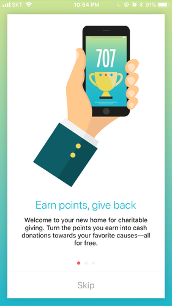
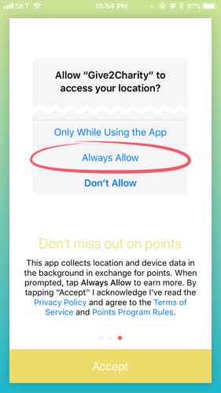
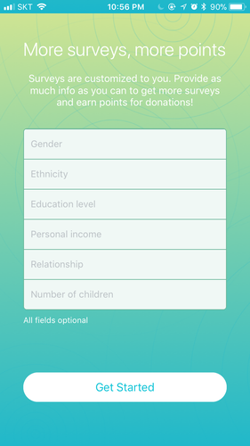
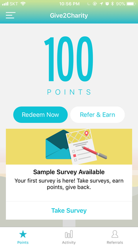
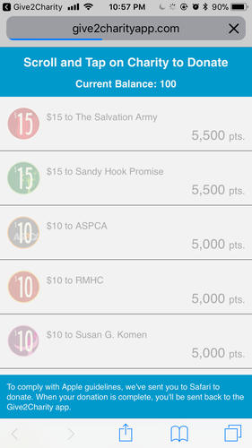
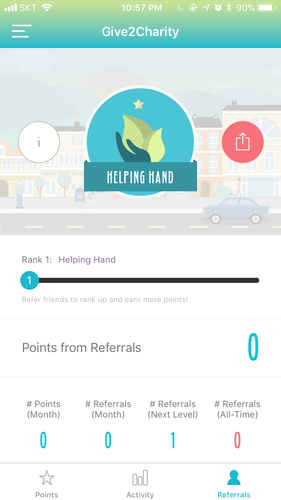
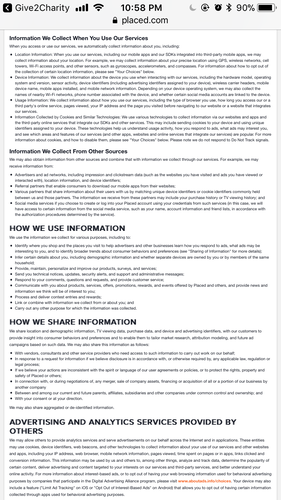
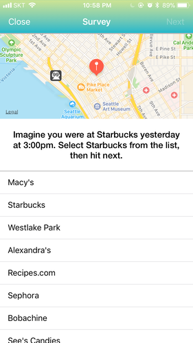

# Give2Charity

## Summary

This is an interesting charity app in that users do not donate money, but rather their personal information via location tracking, cookies, browser history, referrals, and survey responses.

There is some light gamification by accruing points from these various personal information gathering, but the whole thing is a little off putting to be honest. I personally don't like the idea of my personal information being sold to data mining or targeted advertisement. That said, for people without a means to give, Give2Charity offers an alternative option.

Points can be redeemed at your choice of charity (but this happens on a website instead of the app) for donations around $10-15 for 5,000-5,500 points. I'm not sure how long/how much time it would take to get that many points, but I imagine it is not a trivial length.

### Pros:

* 👍 No direct monetary costs
* 👍 Lightly gamified interface

### Cons:

* 👎 Gain points/donation through personal data collection
* 👎 Donation selection happens via external website
* 👎 Likely slow/high time investment accrual of donation Points
* 👎 Charities are external and do not show much information in-app
* 👎 Can lead to targeted advertisements on your device

## Screenshots

