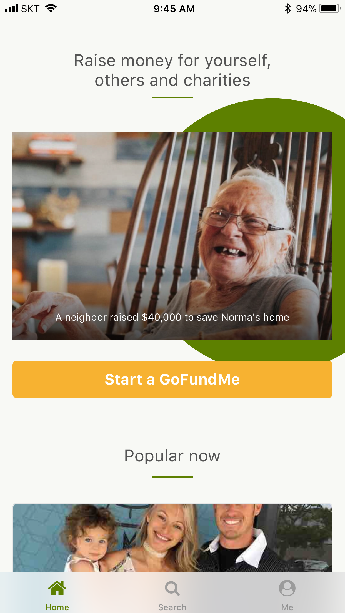
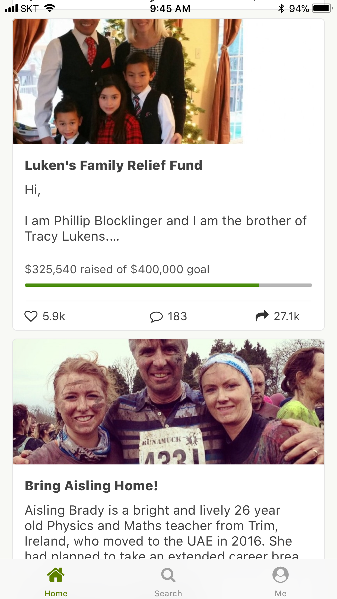
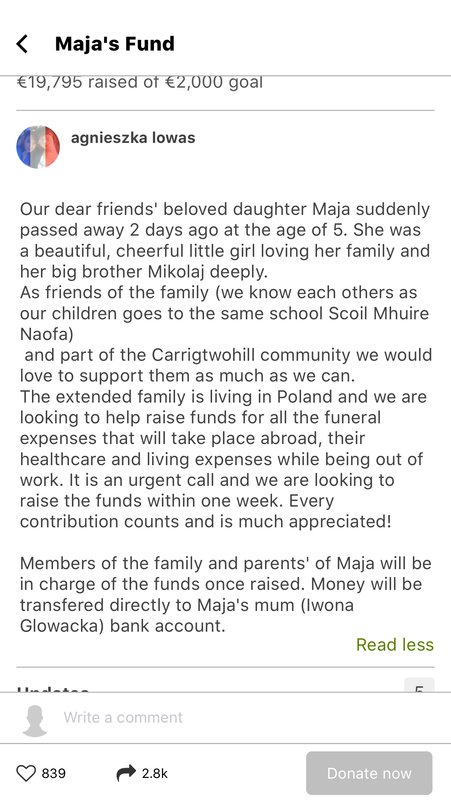
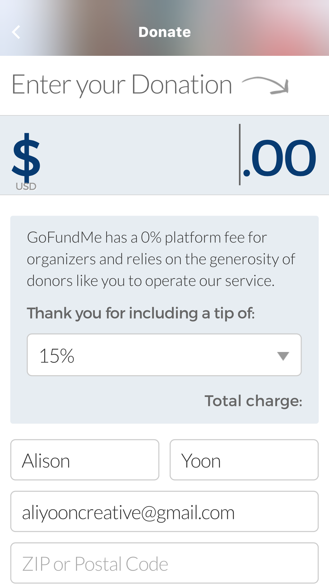
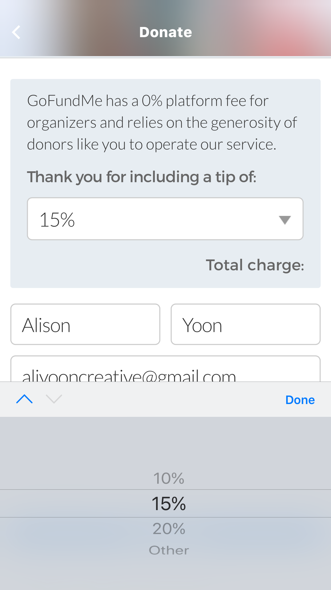
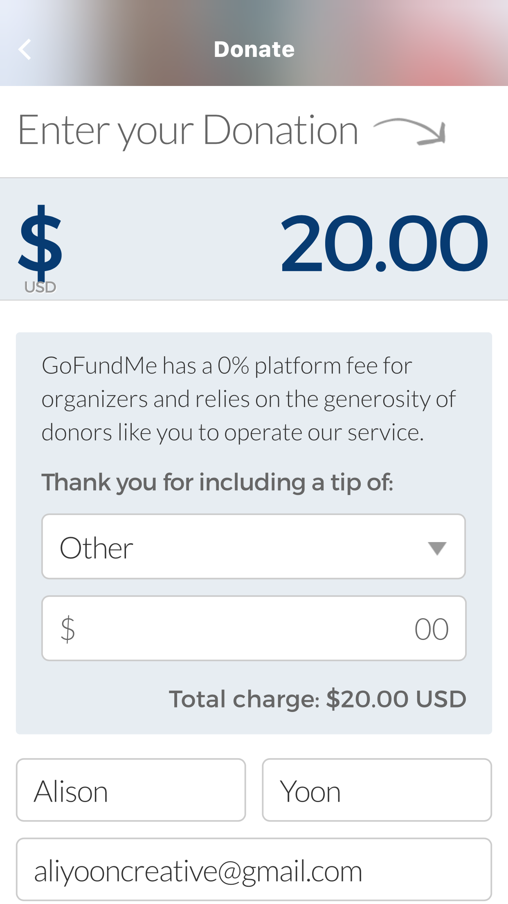

# Go Fund Me

## Summary
This has both web and mobile app.
Individuals can start a fund-raising campaign and people usually do this by uploading photos and story. 

In the giving donation process, you can choose how much money you’d like to give to this organization(in the iOS app) 

GoFundMe asks you to sign in/sign up at the very beginning of the app. 
Below is the policy I found from their website.
This policy shows with the sign in page.

> Policy:
> GoFundMe's fee is 5% from each donation you receive. The payment processor fee is 2.9% + $0.30 per donation. By continuing, you agree with the GoFundMe fees, terms and privacy policy.

## Screenshots

