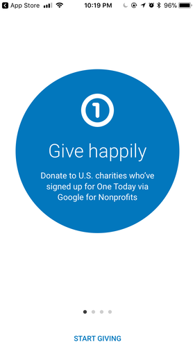
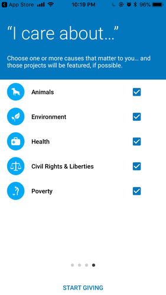
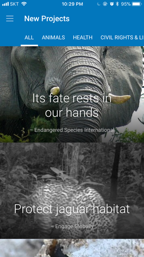
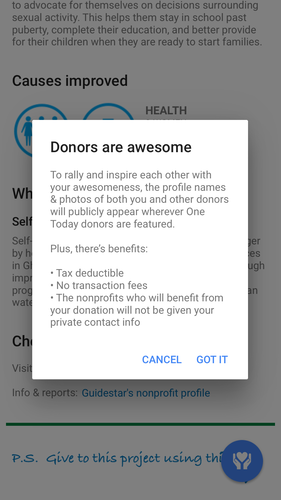
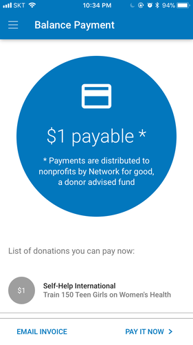
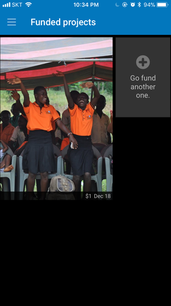

# One Today

## Summary
This is Google's "One Today" (https://onetoday.google.com) charity app.

This app starts with a checkbox list of selection areas that you care about (Animals, Environment, Health, Civil Rights & Liberties, Poverty). Afterwards you select your google account to log in and it populates the projects with charities in your selected areas.

Charities create info pages for their causes which show up on project lists.

The app is interesting in that it offers a social networking aspect by offering "Matching" donations. i.e. you can offer $1 matching donation for someone else's donation.

However, the charities are all separate entities and link to more information to a website.

Pros:
Social Integration

Community Encouragement through Matching system

Simple donation system

Donation Tracking

Achievement system

Cons:

No detailed information about where your money goes or exactly how it is used

Charities link to external websites

Policies vary depending on individual charity (some give detailed info in app, others give less)

Lack of standardization across charities for information

## Screenshots

