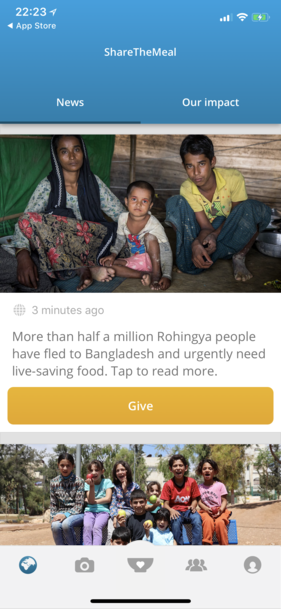

# Share The Meal

## Summary

From launching the App to making a donation took under 2 minutes, including payment. Whilst the user interface is a little jagged at times, there is no doubting the simplicity of this App. I like how the news articles link directly through to the donations page, and how the default is not to give a recurring donation. The range of payment options offered made donation simple.

I did feel the app lacked feedback about the specifics of your donation. I’d be keen to understand how £0.35 can go towards providing a meal. Being able to see the breakdown behind these numbers would be interesting.

The feedback after the donation felt canned and added little information. Use of stock photography, whilst beautiful, feels generic and unrelated to the specifics of the donation or the request.

Facebook and notification features felt unnecessary as it remains unclear what value they would add.

### Cons:

* 👎 limited information on how money is spent
* 👎 unclear why notifications are requested at all
* 👎 unclear why Facebook is used

### Pros:

* 👍 range of payment options including Apple Pay
* 👍 news feed of recent articles links directly through to giving

## Screenshots

