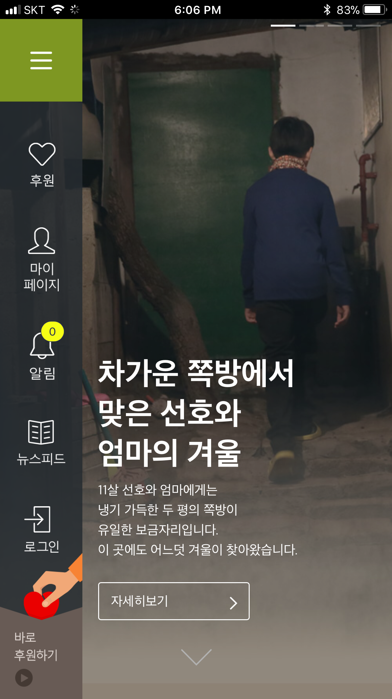
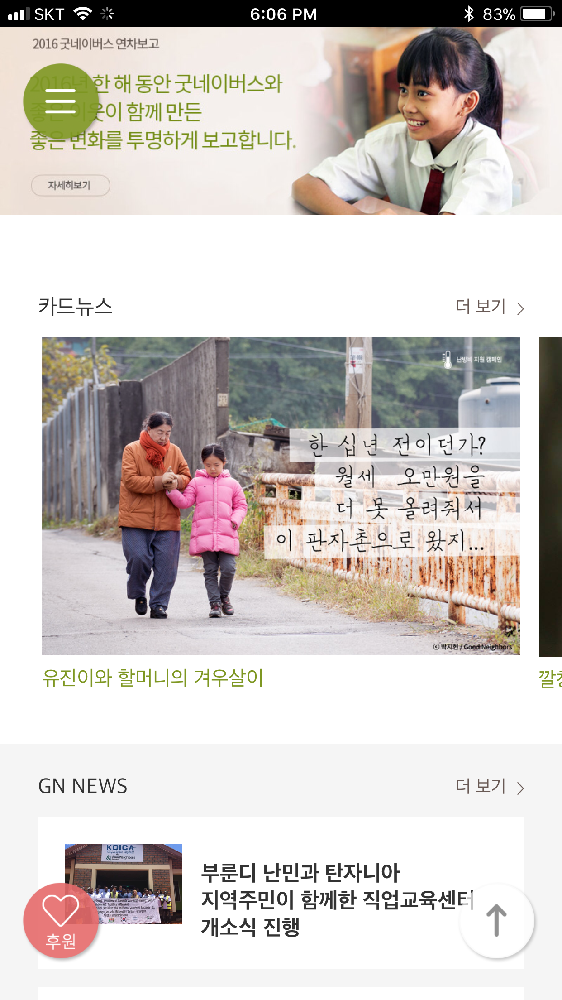
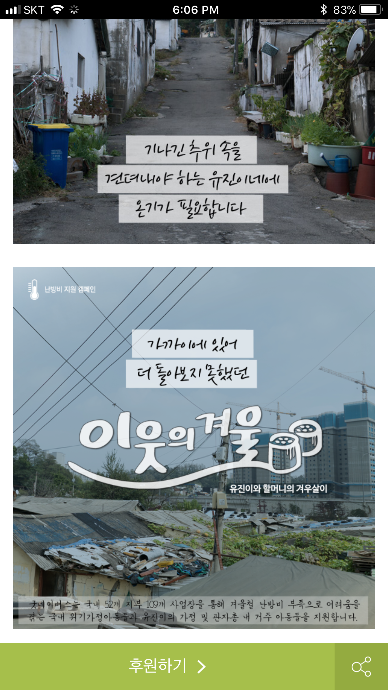
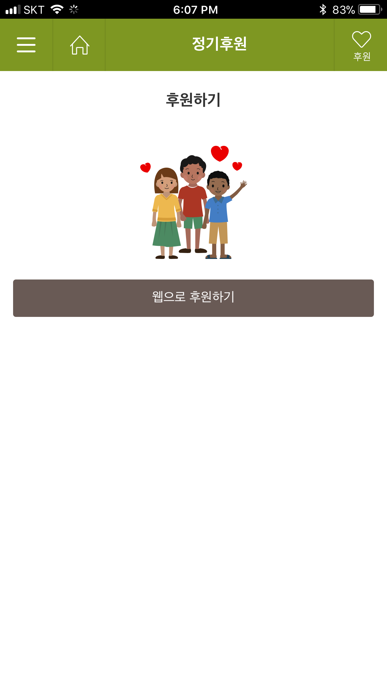
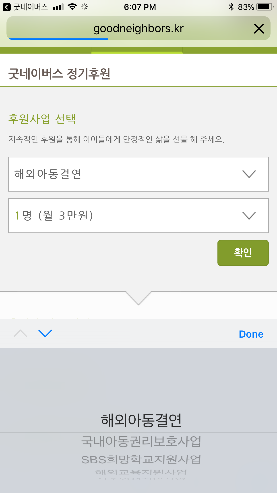

# Good Neighbors

## Summary
This is a Korean charity organization and this is the app which make me came up with this project idea.
Like I’ve already told you in the #background channel, not only this app doesn’t allow you make donation in its app but when you are redirected to their mobile web, you now don’t know anymore where exactly you’re sending the money to. Also, the default screen is to make you to commit to be a regular donator so this could be burdening as well. 

What’s good about this app is that its story telling. 
It introduces people’s story with card news, and each story also has story with photos, easy to scroll down and feel empathy.

## Screenshots

